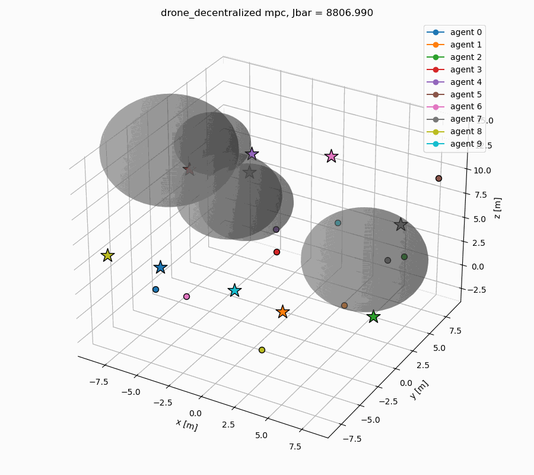

# Distributed & Decentralized MPC

This project implements Distributed and Decentralized Model Predictive Control (DMPC) strategies for multi-agent systems using **CasADi**.

<table>
  <tr>
    <td>
      
    </td>
    <td>
      
    </td>
  </tr>
</table>


## Features

### Control Architectures
There are two main architectures for DMPC implemented
- **Distributed**: Single, centralized solver solves a global optimization problem. More computationally intensive but may yield better performance.
- **Decentralized**: Agents solve local optimization problems and share solutions. Less computationally intensive but may yield suboptimal performance.
  - *Jacobi*: Agents' solutions are shared after each horizon iteration.
  - *Gauss-Seidel*: Agents' solutions are shared immediately after each agent's update.
  
Both architectures support:
- **Standard**: Each agent plans its trajectory independently.
- **Leader-Follower**: One agent (leader) plans its trajectory, and followers plan their trajectories to track the leader.
- **Rendezvous**: Agents rendezvous with one another.

### Dynamics

Each agent's dynamics are defined by two functions, `f_true` and `f_plant`:

- `f_true` is a NumPy function for the **true plant** dynamics.
- `f_plant` is a CasADi function for the **plant model** dynamics used by the MPC solver. 
- Note: `f_plant` and `f_true` may differ in terms of integrator choice, model fidelity (e.g., nonlinear vs. linear, full-order vs reduced-order), stochasticity, etc. 
  - In general, `f_true` should implement a high-fidelity representation of the system dynamics, including any real-world phenomenon like stochasticity, disturbances, etc.
  - By contrast, `f_plant` can implement a low-fidelity, reduced-order, or virtual representation of the plant dynamics that the MPC solver interacts with. Ideally, this implementation should be computationally efficient to allow for real-time control.

### Constraints
- **Input constraints**: Specify minimum and maximum control input values.
- **Inter-agent collision avoidance**: Specify minimum distance between agents.
- **Obstacle avoidance**: Place static, spherical obstacles in the environment (with dynamic obstacles planned).

### MuJoCo Integration
This repository integrates with MuJoCo for high-fidelity simulation of `f_true` dynamics. To make use of this feature:
1. Specify the per-agent `qpos`, `qvel`, and input dimensions as `nq`, `nv`, and `na`, respectively.
   - Note that `nq`, `nv`, and `na` may differ from the state and input dimensions used by the MPC solver, `nx` and `nu`.
2. Implement `f_true`, which should query `mj_data` to retrieve the system state. This function receives the following arguments:
   - `m`: Agent index.
   - `mj_model`: MuJoCo model object.
   - `mj_data`: MuJoCo data object.
   - `u`: Control input as computed by the MPC solver.
3. Specify the MuJoCo XML and generate the accompanying XML configuration object:
   - Specify the complete `<body>` definition tag for a single agent.
   - Specify the input definition tag for a single agent (i.e., `<motor>`, `<general>`, etc), without the enclosing `<actuator>` tag.
4. Load and reset the MuJoCo simulation objects with `load_model()` and `reset_model()`, respectively. Also, specify visualization presets, if desired.
5. Run the DMPC simulation and ensure the flag `use_mj` is set to `True`.

### Examples
- **Bicycle**: 5-state, two-dimensional kinematic bicycle model. 
  - `f_plant` and `f_true`: implemented identically with forward Euler integration.
- **Double Integrator**: 12-state, three-dimensional double integrator model.
  - `f_plant` and `f_true`: implemented identically with forward Euler integration.
- **Drone**: Three-dimensional quadcopter dynamics.
  - `f_plant` implements reduced-order (6-state) quadcopter dynamics (with forward Euler integration) for virtual input computation.
  - `f_true` uses MuJoCo to obtain full-state quadcopter dynamics.

### State Estimation
Planned.

## Installation

Create and activate the conda environment:
```bash
conda env create -f environment.yml
conda activate dmpc
```

## Usage

Run the `<model>.py` scripts. Plots are saved to the `plots/` directory.
```bash
python3 -m scripts.bicycle # Bicycle dynamics
python3 -m scripts.dbl_int # Double integrator dynamics
python3 -m scripts.drone   # Drone dynamics
```

## Structure

`scripts/`: Example scripts for different dynamics models.
- `bicycle.py`: Example script for bicycle dynamics.
- `dbl_int.py`: Example script for double integrator dynamics.
- `drone.py`: Example script for drone dynamics.

`src/`: Source code for DMPC implementations.
- `distributed_mpc.py`: Distributed MPC implementation.
- `decentralized_mpc.py`: Decentralized MPC implementation (Jacobi and Gauss-Seidel).
- `distributed_mpc_leader.py`: Distributed MPC with leader-follower architecture.
- `decentralized_mpc_leader.py`: Decentralized MPC with leader-follower architecture.
- `distributed_mpc_rendezvous.py`: Distributed MPC for rendezvous tasks.
- `decentralized_mpc_rendezvous.py`: Decentralized MPC for rendezvous tasks.

`utils/`:
- `plot_utils.py`: Plotting utilities
- `mj_utils.py`: MuJoCo utilities for XML generation, visualization, etc.

`run.sh`: Shell script to re-run example scripts repeatedly until all simulations complete successfully.
  - Usage: `bash run.sh model_name` (e.g., `bash run.sh bicycle`).
