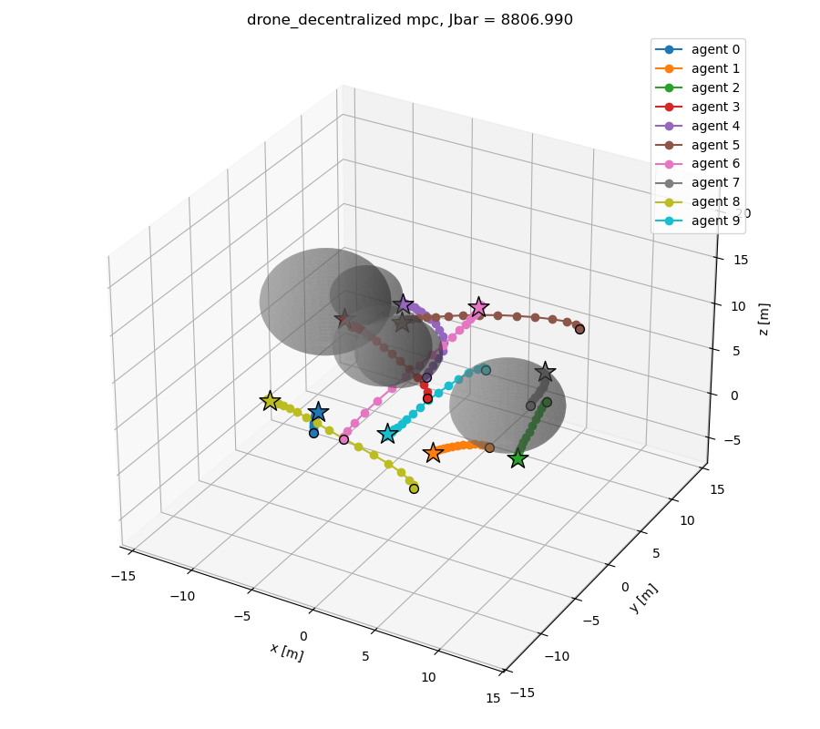

# Distributed & Decentralized MPC

This project implements Distributed and Decentralized Model Predictive Control (DMPC) strategies for multi-agent systems using **CasADi**.



## Features

### Control Architectures
- **Distributed**: Single, centralized solver solves a global optimization problem. More computationally intensive but may yield better performance.
- **Decentralized**: Agents solve local optimization problems and share solutions. Less computationally intensive but may yield suboptimal performance.
  - *Jacobi*: Agents' solutions are shared after each horizon iteration.
  - *Gauss-Seidel*: Agents' solutions are shared immediately after each agent's update.

### Dynamics
#### Models
- *Drone*: 12-state quadrotor dynamics.
- *Bicycle*: 5-state kinematic bicycle model.
- *Custom*: Specify your own dynamics.

#### Integrators
- *Forward Euler*
- *Runge-Kutta (RK4)*
- *Custom*: Specify your own integrator.

### Constraints
- **Control constraints**: Specify minimum and maximum control inputs.
- **Inter-agent collision avoidance**: Specify minimum distance between agents.
- **Obstacle avoidance**: Customizable static obstacles in the environment. Dynamic obstacles planned.

### Stochasticity and Uncertainty
Planned.

## Installation

Create and activate the conda environment:
```bash
conda env create -f environment.yml
conda activate dmpc
```

## Usage

Run the `<model>_dyn.py` scripts. Plots are saved to the `plots/` directory.
```bash
python3 bicycle_dyn.py # Bicycle dynamics
python3 drone_dyn.py # Drone dynamics
```

## Structure

- `bicycle_dyn.py`: Bicycle dynamics.
- `drone_dyn.py`: Drone dynamics.
- `distributed_mpc.py`: Implementation of distributed MPC solver.
- `decentralized_mpc.py`: Implementation of decentralized MPC solver.
- `plot.py`: Plotting utilities.
